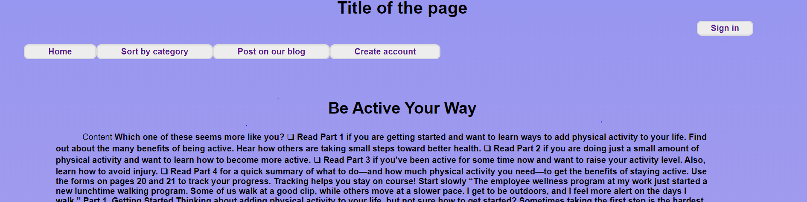
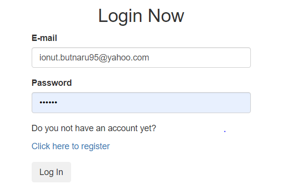
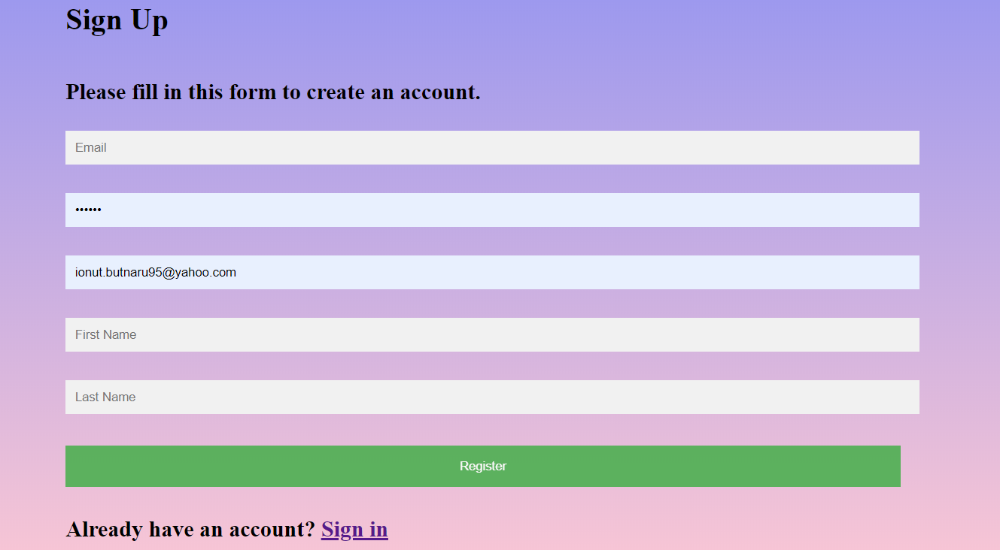
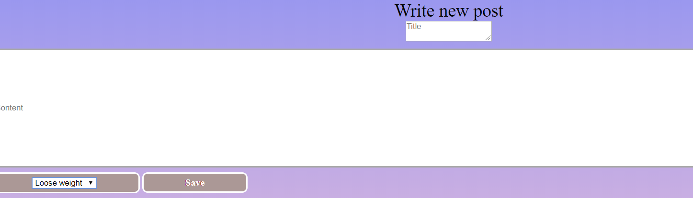

**Spring Boot Blog**

**Description**

Project built with Spring Boot & Thymeleaf. This was connected with a local DBeaver data base by using Spring Data JPA. The login and registration security of the app is being ensured with Spring Security.

The anonymous user can use the page and see the posts and comments from the page.
Also they can access the Sorty By Category function in order to get the posts sorted by category.
 

On the home page, you may find 5 posts per page and on the sorted by category, 10, having the possibility to switch them by clicking on the numbers found on the bottom.

In case the user is not logged in, clicking on the Post on our blog button will take him to the Log in page, same as Sign in button.

The user has the possibility to create an account by accessing the "Create account" button or from login page.

Once logged in, the user can add posts and comments on the blog.

The post can be accessed each in particular no matter if the user is registered or not.

Once the post is accessed, you have the possibility to see the dropdown button with all the comments and the button with "Leave a comment", which, in case you are not logged in will take you to the log in page.

If the logged in user is the one who posted that specific article, is able to access other functionality, "Edit" and "Delete".

**Configuration**

Has been made in src/main/resources/application.properties. There the connection with the DB has been set and also the dialect.

**Run**
 
Can run this application from the command line but also from Intellij.
 
Once the application is running acccess http://localhost:8080/.
In order to see the entire functionality you must create an account and be log in with the previous entered details.

**Actions**

Storing accounts and text in database and offering access to the account with the credentials. The users can add own posts and opinions on the blog.

**Improvements:**

User profile.
Other roles besides "ROLE_USER", an admin that controls the actions of the users.
Full authority for the admin, including blocking/deleting an account.
Show each posts` comments underneath, with the possiblity to add comments without going to another page.
Work in progress.

